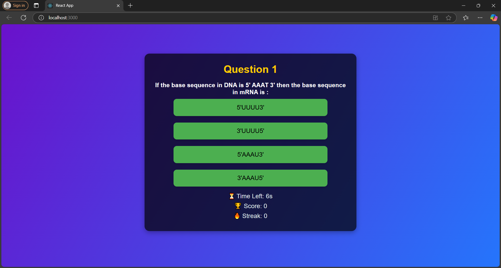
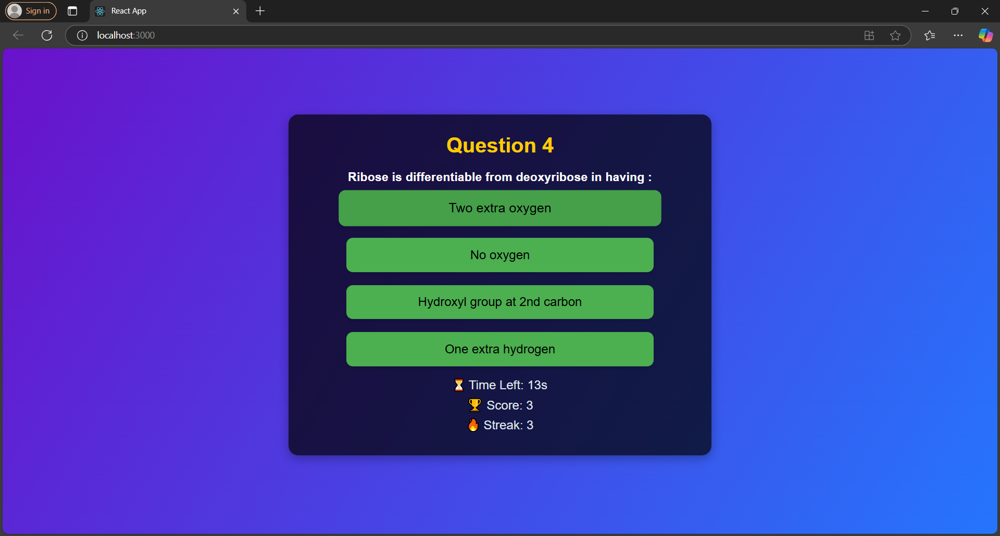
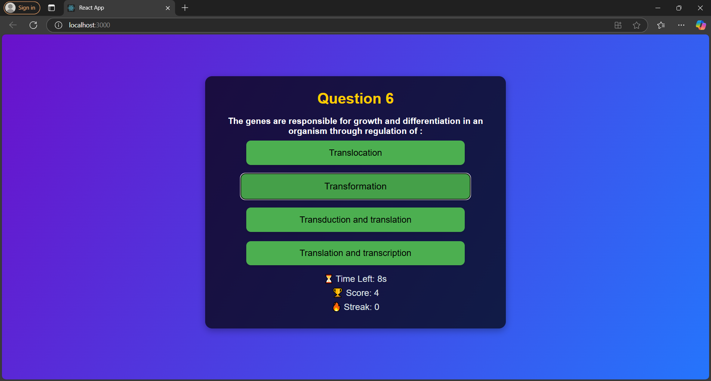
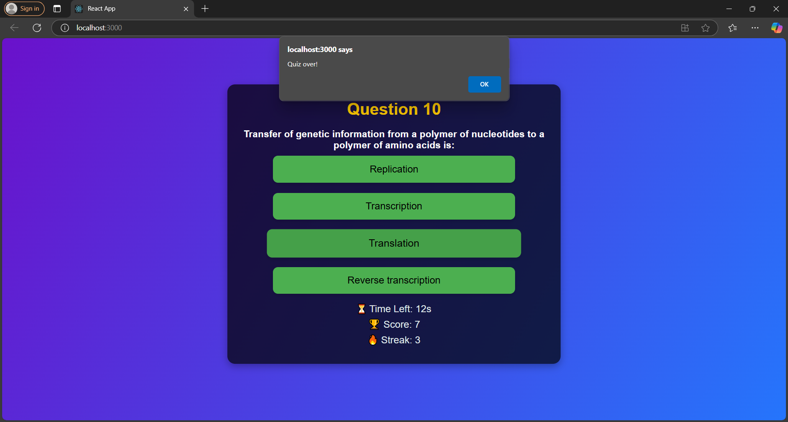
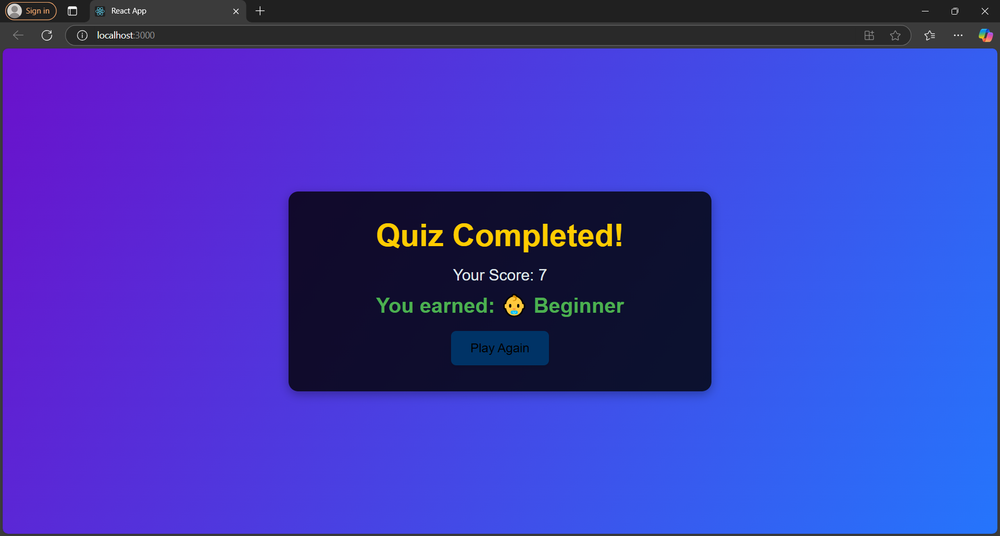

Quiz App

**Project Overview:- **
This is a web-based quiz application built using React. The app fetches quiz data from an external API using a Node.js backend (server.js) and presents it through a clean, engaging user interface. It features multiple-choice questions, gamification, and a score summary upon quiz completion.

**Tech Stack:-**
Frontend: React.js
Backend: Node.js (server.js)
Styling: CSS
Assets: Audio files (for correct/wrong answer sounds)
Folder Structure
quiz-appcd/
│Quiz App
Project Overview
This is a web-based quiz application built using React. The app fetches quiz data from an external API using a Node.js backend (server.js) and presents it through a clean, engaging user interface. It features multiple-choice questions, gamification, and a score summary upon quiz completion.

**Files and Explanation:-**

1. assets/
   correct.mp3: Audio played when the user selects the correct answer.
   wrong.mp3: Audio played when the user selects the wrong answer.
   
3. components/
     - QuizApp.js:-
       
         This is the main component of the application. It handles the overall logic of the quiz, such as:
               Fetching quiz data from the server (Node.js backend).
               Managing the quiz state, including the current question, score, and timer.
               Displaying the question and options for the user to select.
               Moving to the next question and keeping track of the user's score.
       
      - Question.js:-
  
  This component is responsible for displaying each question along with its multiple-choice options.
        It Takes in the question data as props.
       Displays the question and a list of options.
        Calls a function in QuizApp.js to handle the user's selection of an answer.
  
3. styles/:-
       styles.css: This file contains global CSS styles for the app. It styles the main quiz container, questions, and answer buttons to provide an appealing and user-friendly interface.
   
5. App.js:-
   
    This file serves as the entry point of the React app. It renders the QuizApp.js component and provides any additional functionality or styling that needs to be applied globally.

6. index.js:-
        The entry point of the React application. It renders the root component (App.js) to the DOM.

7. server.js:-
       The server.js file acts as the backend for fetching quiz data from the provided external API URL. It uses Node.js to create a simple server that:
       Handles GET requests to fetch quiz data from the API.
       Sends the data to the React app through a local server.
       This ensures that the frontend (React) can fetch the quiz questions dynamically.
   

**How to Run the App**
To run this application locally, follow these steps:
Steps 

 1. Clone the repository to your local machine.
    git clone https://github.com/surbhi1662/Quiz_App.git
    
2. Navigate to the project folder:
   
     cd quiz-appcd

4. Install the dependencies:
      npm install

5. Start the Node.js server:
      node server.js
  

6. Start the React app:
      npm start

## Video Walkthrough

Here is a video walkthrough of the Quiz App:

[Watch the Quiz App Video on Google Drive](https://drive.google.com/file/d/1816A9Hbem4xqezXvPugdJI99vK6bm2U2/view?usp=sharing)

**Screenshots**

**License**

This project is licensed under the MIT License - see the LICENSE file for details.

